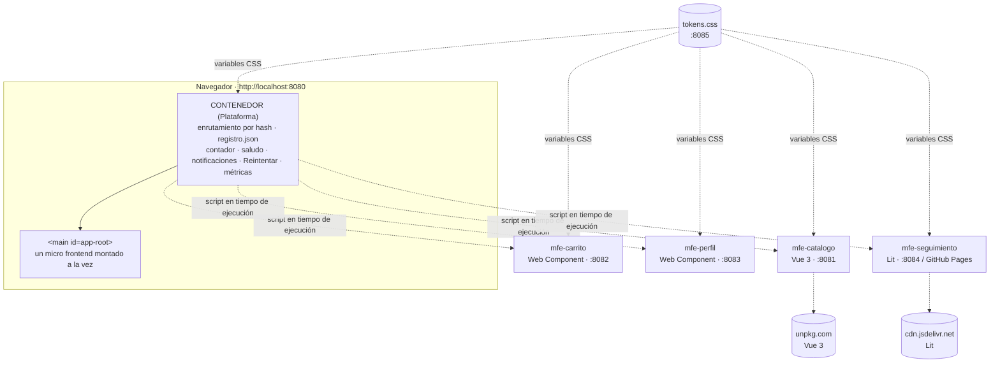

# SaborUPC 2.0 · Contenedor (equipo Plataforma)

Actividad 2 de Arquitectura de Aplicaciones Web (Universidad Popular del Cesar): **equipos autónomos, tecnologías distintas**.
SaborUPC es una tienda de comida típica en la que cada sección pertenece a un equipo distinto, vive en su propio
repositorio y se sirve desde su propio origen. Este repositorio es la aplicación contenedora y la documentación de arquitectura.

## Repositorios y equipos

| Repositorio | Equipo · dueño | Qué contiene | Tecnología | Local | Publicado |
|---|---|---|---|---|---|
| [saborupc-contenedor](https://github.com/Suppra/saborupc-contenedor) | Plataforma · Mario | Contenedor, `registro.json`, notificaciones, resiliencia, `CONTRATOS.md`, pruebas e2e | JS puro | http://localhost:8080 | — |
| [saborupc-tokens](https://github.com/Suppra/saborupc-tokens) | Plataforma · Mario | `tokens.css` (sistema de diseño) | CSS | http://localhost:8085 | — |
| [saborupc-perfil](https://github.com/Suppra/saborupc-perfil) | Plataforma · Mario | `<mfe-perfil>` | Web Component JS | http://localhost:8083 | — |
| [saborupc-catalogo](https://github.com/Suppra/saborupc-catalogo) | Descubrimiento · Camilo | Catálogo con búsqueda y filtro por categoría | **Vue 3** (unpkg) | http://localhost:8081 | — |
| [saborupc-carrito](https://github.com/Suppra/saborupc-carrito) | Pedidos · Christian | `<mfe-carrito>`, publica `pedido:confirmado` | Web Component JS | http://localhost:8082 | — |
| [saborupc-seguimiento](https://github.com/Suppra/saborupc-seguimiento) | Pedidos · Christian | `<mfe-seguimiento>` (`#/pedidos`) | **Lit** (jsDelivr) | http://localhost:8084 | https://suppra.github.io/saborupc-seguimiento/ |

## Diagrama de arquitectura



Comunicación (solo eventos en `window`, detalle en [CONTRATOS.md](CONTRATOS.md)):

```
mfe-catalogo ──carrito:agregar──▶ mfe-carrito ──carrito:actualizado──▶ contenedor (contador)
                                  mfe-carrito ──pedido:confirmado───▶ mfe-seguimiento ──pedido:estado──▶ contenedor (notificación)
mfe-perfil ──usuario:cambio──▶ contenedor (saludo)
```

## Cómo ejecutar

Requisitos: Python 3 (o Node.js) y un navegador moderno. Sin compilación.

**Todo junto.** Clone los seis repositorios uno al lado del otro y ejecute desde este:

```bash
bash iniciar.sh        # Linux / macOS (Windows: doble clic en iniciar.bat)
```

y abra http://localhost:8080.

**Cada pieza por separado** (una terminal por equipo):

| Carpeta | Comando | Modo independiente | Prueba de contrato |
|---|---|---|---|
| `saborupc-contenedor` | `python -m http.server 8080` | — | — |
| `saborupc-catalogo` | `python -m http.server 8081` | http://localhost:8081 | http://localhost:8081/contrato.html |
| `saborupc-carrito` | `python -m http.server 8082` | http://localhost:8082 | http://localhost:8082/contrato.html |
| `saborupc-perfil` | `python -m http.server 8083` | http://localhost:8083 | http://localhost:8083/contrato.html |
| `saborupc-seguimiento` | `python servidor.py 8084` (necesita CORS) | http://localhost:8084 | http://localhost:8084/contrato.html |
| `saborupc-tokens` | `python -m http.server 8085` | http://localhost:8085 | — |

**Usar los micro frontends publicados en internet:** abra http://localhost:8080/?origen=publicado. El contenedor usa la
`urlPublicada` de `registro.json` (hoy Seguimiento en GitHub Pages) y la `url` local para el resto.

## Pruebas

```bash
npm install && npx playwright install chromium
bash iniciar.sh &      # las seis piezas arriba
npm test
```

`pruebas/e2e.mjs` recorre toda la aplicación (29 verificaciones): carga por origen y tiempos, catálogo Vue, eventos,
seguimiento con estados automáticos y notificaciones, perfil, consola sin errores, caída de Perfil con Reintentar,
despliegue de una versión nueva del catálogo, y las cuatro páginas `contrato.html` (45 verificaciones más).
Las capturas quedan en `capturas/`.

## Requisitos de la actividad → dónde se cumplen

| # | Requisito | Dónde |
|---|---|---|
| 1 | Repositorios separados | Un repositorio por pieza; cada integrante hace commits solo en los suyos. |
| 2 | Seguimiento de pedidos | `saborupc-seguimiento` (estados con `setInterval`, publica `pedido:estado`) + notificación en `contenedor.js` |
| 3 | Heterogeneidad | Catálogo en **Vue 3** y Seguimiento en **Lit**, ambos desde CDN y sin compilación |
| 4 | Contrato versionado | [CONTRATOS.md](CONTRATOS.md): `version` en todos los eventos; `pedido:confirmado` 1.0 → 1.1 compatible |
| 5 | Prueba de contrato | `contrato.html` en catálogo, carrito, perfil y seguimiento |
| 6 | Sistema de diseño | `saborupc-tokens/tokens.css` en su propio origen, usado por todos |
| 7 | Resiliencia y observabilidad | Mensaje + botón **Reintentar**; tiempos de carga con `performance.now()` en consola y `performance.measure` |
| 8 | Despliegue independiente | Guion del video en [docs/GUION-VIDEO.md](docs/GUION-VIDEO.md); Seguimiento publicado en GitHub Pages |

## Decisiones tomadas

1. **Registro como configuración (`registro.json`).** El contenedor no tiene URLs en el código. Agregar o mover un micro
   frontend es editar un JSON, sin tocar `contenedor.js`. Por ser del mismo origen que el contenedor, no requiere CORS.
2. **Dos estilos de contrato de montaje.** El catálogo conserva `renderCatalogo`/`unmountCatalogo` para demostrar que se
   puede cambiar de tecnología (JS → Vue) sin cambiar el contrato. Carrito, Perfil y Seguimiento usan Web Components,
   que aíslan el CSS con Shadow DOM.
3. **Lit como módulo ES.** Lit se distribuye como módulo, así que el registro admite `"modulo": true` y el contenedor
   crea `<script type="module">`. Los módulos de otro origen exigen CORS: por eso Seguimiento trae `servidor.py`
   (GitHub Pages ya envía `Access-Control-Allow-Origin: *`).
4. **Vue cargado por el propio catálogo.** `catalogo.js` descarga Vue desde unpkg la primera vez que se monta. El
   contenedor no sabe que el catálogo usa Vue, y otro equipo podría usar otra versión de Vue sin acuerdo previo.
5. **Precarga de quien escucha.** Carrito y Seguimiento registran sus listeners al cargarse; por eso van con
   `"precargar": true`. Si no, el primer `pedido:confirmado` se perdería.
6. **Versionado `MAYOR.MENOR` y lector tolerante.** Agregar campos es compatible; quitar o renombrar exige un evento nuevo.
7. **Tokens solo con variables.** `tokens.css` no tiene clases ni selectores de etiquetas, así que no puede romper el
   marcado de nadie. Las variables CSS sí atraviesan el Shadow DOM. Cada `var()` lleva valor por defecto.
8. **Resiliencia en el contenedor.** Si un script falla, el contenedor descarta la promesa en caché y el botón
   Reintentar vuelve a pedir el script con otro `?v=`, sin recargar la página ni perder el estado de los demás.
9. **Sin caché en desarrollo (`?v=Date.now()`).** Al recargar siempre se ve la última versión desplegada de cada pieza.
   En producción se usarían nombres con hash y un manifiesto.

## Equipo

- **Mario** · equipo Plataforma: contenedor, tokens, perfil, contratos.
- **Camilo** · equipo Descubrimiento: catálogo en Vue 3 y su prueba de contrato.
- **Christian** · equipo Pedidos: carrito y seguimiento en Lit.
